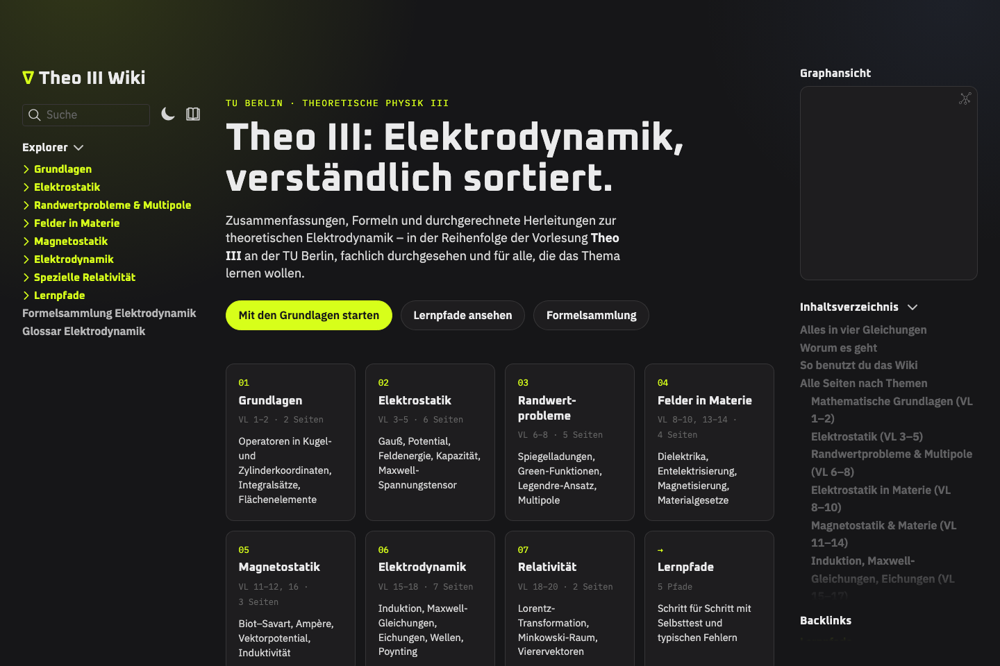

# Theo III – Elektrodynamik (Lernwiki)

Lernwiki zur **Theoretischen Physik III (Elektrodynamik)** an der TU Berlin –
Zusammenfassungen, Formeln und Herleitungen in der Reihenfolge der Vorlesung,
gebaut als statische Website aus Markdown-Notizen.

**→ Online lesen: <https://theo3.sadowski-dos-santos.de>**



## Inhalt

34 Seiten in sieben Themenblöcken. Die Notizen habe ich auf Basis der Vorlesung
Theoretische Physik III an der TU Berlin (WiSe 25/26, VL 1–20) selbst angefertigt:

| Block | VL | Themen |
| --- | --- | --- |
| 01 Grundlagen | 1–2 | Operatoren in krummlinigen Koordinaten, Integralsätze, Flächenelemente |
| 02 Elektrostatik | 3–5 | Gauß, Potential, Feldenergie, Kapazität, Maxwell-Spannungstensor |
| 03 Randwertprobleme | 6–8 | Spiegelladungen, Green-Funktionen, Legendre-Ansatz, Multipole |
| 04 Felder in Materie | 8–10, 13–14 | Dielektrika, Entelektrisierung, Magnetisierung, Materialgesetze |
| 05 Magnetostatik | 11–12, 16 | Biot–Savart, Ampère, Vektorpotential, Induktivität |
| 06 Elektrodynamik | 15–18 | Induktion, Maxwell-Gleichungen, Eichungen, Wellen, Poynting |
| 07 Relativität | 18–20 | Lorentz-Transformation, Minkowski-Raum |

Dazu kommen eine **Formelsammlung**, ein **Glossar** mit Kurzerklärungen,
fünf **Lernpfade** mit Schritten, Selbsttest und typischen Fehlern sowie
zehn **Beispielaufgaben** mit ausklappbarer Lösung auf den passenden Seiten.
Alle Seiten wurden
fachlich durchgesehen (Vorzeichen, Dimensionen, Grenzfälle). Es bleiben
studentische Notizen – Fehler bitte als
[Issue](https://github.com/luisadow/theo-iii-wiki/issues/new) melden.

## Features

- **Obsidian-Workflow:** Notizen entstehen als Markdown mit Wikilinks und
  LaTeX in Obsidian und werden 1:1 zur Website.
- **Formeln** mit KaTeX, **Volltextsuche**, Link-Vorschau beim Hover,
  Graphansicht, Rückverweise und Inhaltsverzeichnis pro Seite; Selbsttests
  mit im Browser gespeicherten Checkboxen; Zurück/Weiter-Navigation entlang
  der Lernpfade.
- **Eigenes Design:** Startseite mit Themenkarten, heller und dunkler Modus,
  responsiv bis Smartphone-Breite.
- **SEO:** individuelle Meta-Beschreibungen, Canonical-URLs, strukturierte
  Daten (schema.org `LearningResource`), Sitemap, RSS und Open-Graph-Bilder;
  nach jedem Deploy werden alle URLs per **IndexNow** an Bing & Co. gemeldet.
- **Deployment:** jeder Push auf `main` baut die Seite per GitHub Actions und
  veröffentlicht sie auf GitHub Pages.

## Technik

| | |
| --- | --- |
| Generator | [Quartz v4](https://quartz.jzhao.xyz/) (TypeScript, Preact, unified/remark) |
| Inhalte | Markdown in `content/`, Obsidian-kompatibel |
| Styling | SCSS in `quartz/styles/custom.scss`, Farben in `quartz.config.ts` |
| Hosting | GitHub Pages über `.github/workflows/deploy.yml` |

Angepasst gegenüber dem Quartz-Standard: Layout (`quartz.layout.ts`),
Head-Metadaten und strukturierte Daten (`quartz/components/Head.tsx`),
Explorer-Sortierung nach Themenreihenfolge, eigene Komponente
`quartz/components/PrevNext.tsx`, übersichtlicherer Graph (ohne Tags, Namen
nur für die meistverlinkten Notizen), Ordnerlisten mit Seitenbeschreibungen,
keine Tag- und Weiterleitungsseiten (dünne Inhalte), eigenes Theme und Favicon.

## Lokal bauen

```bash
npm ci
npx quartz build --serve   # http://localhost:8080
```

Voraussetzung: Node.js 22 (siehe `.node-version`).

## Projektstruktur

```text
content/
  index.md               Startseite
  01 Grundlagen/ … 07 Relativität/
  Lernpfade/             fünf Lernpfade mit Selbsttest
  Formelsammlung.md
  Glossar.md
quartz/                  Quartz-Quellcode (inkl. eigener Anpassungen)
quartz.config.ts         Titel, Theme, Plugins
quartz.layout.ts         Seitenaufbau
```

## Lizenz

Der Quartz-Code steht unter der MIT-Lizenz (`LICENSE.txt`). Die Notizen in
`content/` habe ich auf Basis der Vorlesung selbst geschrieben; Materialien der
Vorlesung selbst sind nicht enthalten.
